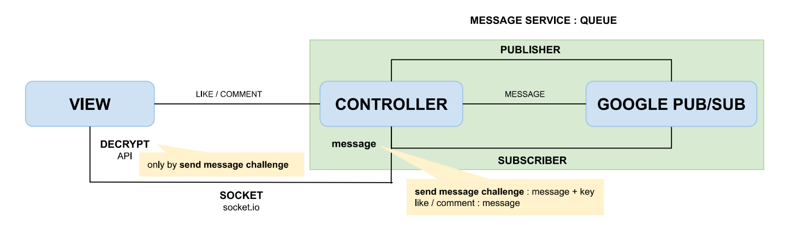

# mern-excercise
latihan MERN Stack menggunakan docker proxy.

## Getting Started

setup local domain `/etc/hosts` tambahkan `$ 127.0.0.1 mern-excercise.local`

development
1. `$ docker-compose -f docker-compose.dev.yml build`
2. `$ docker-compose -f docker-compose.dev.yml up -d`

production
1. `$ docker-compose build`
2. `$ docker-compose up -d`

open browser menggunakan https dengan domain https://mern-excercise.local

websocket http://localhost:8080

### reference
- [MERN Stack](https://github.com/bradtraversy/devconnector_2.0)
- [local ssl](https://hackerrdave.com/https-local-docker-nginx/)
- [refresh token fe](https://www.bezkoder.com/react-refresh-token/)
- [refresh token be](https://medium.com/@had096705/build-authentication-with-refresh-token-using-nodejs-and-express-2b7aea567a3a)
- [runtime env fe](https://blog.risingstack.com/create-react-app-runtime-env-cra/)

flow google pub sub

notification

